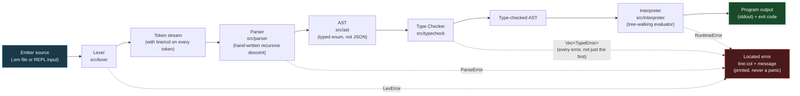
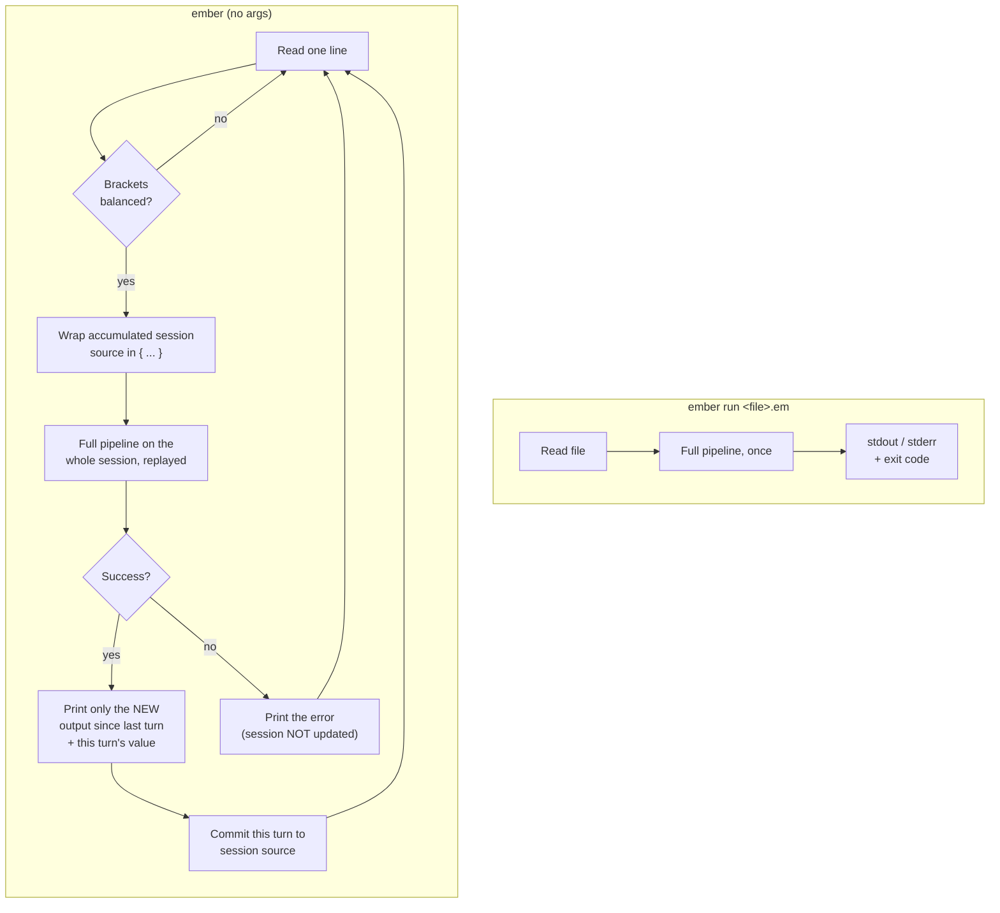
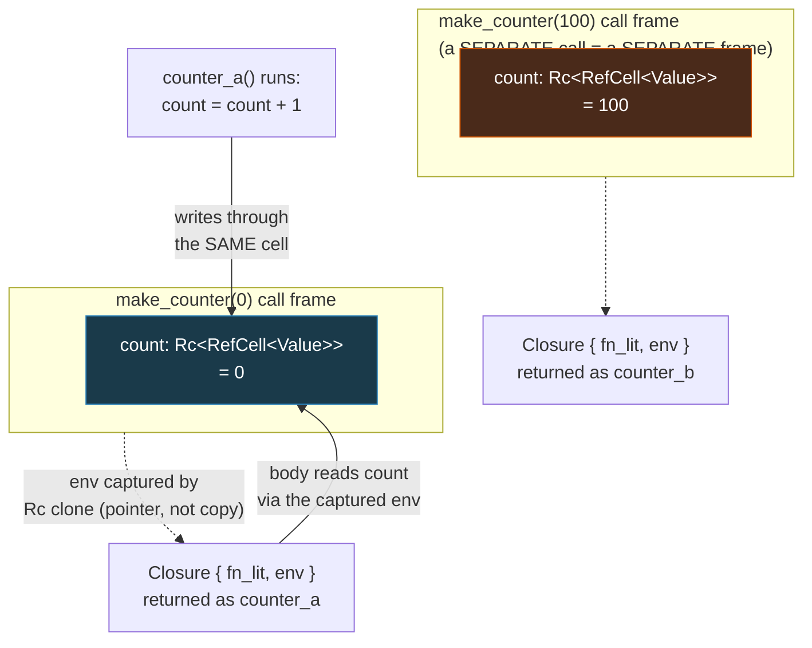

# Ember

A small, statically-typed, expression-oriented programming language —
lexer, hand-written recursive-descent parser, type checker, and
tree-walking interpreter, built from scratch in Rust with no
parser-generator and no external dependencies in the language core.

Full spec: **[docs/LANGUAGE_SPEC.md](docs/LANGUAGE_SPEC.md)**

---

## Why build a language

My other portfolio projects (Scout, Sift, Pulse, Conduit, Orbit) are all
product/API-shaped: they call other people's runtimes and prove I can
integrate, ship, and design around existing services. Ember is
deliberately different. There's no API to call here — the lexer, parser,
type checker, and interpreter all had to be written by hand, which means
every bug in "how does a `for`-free recursive function actually get
called" or "how does a closure remember a variable that gets mutated
later" was mine to find and fix, not a library's.

Concretely, Ember is meant to demonstrate:

- **Real CS fundamentals**, not framework fluency: tokenization, a
  hand-rolled grammar and recursive-descent parser, a static type
  checker that has to reject bad programs *and* accept every valid one,
  and a tree-walking evaluator with correct lexical scoping.
- **Closures done correctly**, which is the single hardest correctness
  bar in this kind of project — mutation-after-capture, independent
  closures from the same factory, deep and mutual recursion, and
  shadowing across nested scopes all have dedicated, passing tests, not
  just prose claims.
- **Honest engineering tradeoffs, stated explicitly** — see
  [Known limitations](#known-limitations) below. A toy interpreter that
  quietly hides its rough edges is worth less than one that names them.

---

## Architecture

Ember source text flows through four independently-testable stages. Each
stage takes the previous stage's output and either produces the next
stage's input, or a **located** error (line + column) — never a Rust
panic on malformed program input.



Two entry points wrap this same pipeline (see
[`src/cli/mod.rs`](src/cli/mod.rs)):



The REPL's "environment" is the growing, successfully-committed source
text itself, replayed from scratch through a fresh `Scope` every turn —
simpler and safer than trying to splice live interpreter state between
calls, and correct because Ember evaluation is deterministic. Only the
newly-produced slice of `print`/`println` output is shown each turn, so
replaying old turns' side effects never reprints them, and a turn that
fails at any stage is never committed, so one mistake at the prompt can't
corrupt the rest of the session.

### The closure model (the hard part)

Closures capture their defining environment **by reference**, not a
snapshot. A `Scope` is `Rc<RefCell<ScopeData>>`, and — this is the detail
that makes mutation-after-capture *structurally* correct rather than
incidentally correct — every individual variable binding inside a scope
is its own `Rc<RefCell<Value>>` cell, not a plain value in a hash map.



Because each *call* to `make_counter` allocates its own fresh scope
frame, `counter_a` and `counter_b` share no memory — mutating one can
never affect the other — while a mutation to `count` made after
`counter_a` was created (but before it's called) is still visible when
it finally runs, because nothing was ever copied. This exact property is
proven directly in
[`src/interpreter/tests.rs`](src/interpreter/tests.rs), not just asserted
in prose.

---

## Project structure

```
Ember/
├── src/
│   ├── ast/            AST node definitions (typed enum, kept separate from parsing)
│   ├── lexer/          source text -> token stream, with line/col on every token
│   ├── parser/         hand-written recursive-descent parser -> AST
│   ├── typecheck/      AST -> type errors (all of them) or nothing
│   ├── interpreter/    type-checked AST -> program execution
│   ├── cli/            file runner + REPL (wiring over the four stages above)
│   └── main.rs
├── examples/           5 runnable .em programs (also run as integration tests)
├── docs/
│   ├── LANGUAGE_SPEC.md    full language spec: types, grammar, semantics
│   └── EXAMPLES_DRAFT.md   the same 5 programs, as originally drafted for design review
└── Cargo.toml
```

Each stage has its own `tests.rs` sitting next to it — lexer tests never
touch the parser, parser tests never touch the type checker, and so on,
so a failure always points at exactly one stage.

---

## Quick start

Requires the stable Rust toolchain (no unstable features used).

```bash
git clone https://github.com/Aryantyagi-2003/Ember.git
cd Ember
cargo build
```

### Run a file

```bash
cargo run -- run examples/fibonacci.em
```

### Start the REPL

```bash
cargo run
```

### Run the test suite / quality gates

```bash
cargo test              # 174 tests across all 5 stages
cargo clippy --all-targets   # zero warnings
cargo fmt --check            # zero diffs
```

---

## It actually runs — real terminal output

All 5 example programs, executed for real, output captured directly from
the terminal (not hand-typed):

```
$ ember run examples/fibonacci.em
6765

$ ember run examples/closures.em
1
2
101
3

$ ember run examples/array_mutability.em
15

$ ember run examples/bubble_sort.em
1
2
3
5
8
9

$ ember run examples/mutual_recursion.em
true
```

`closures.em` is worth pointing at directly: `1`, `2`, `101`, `3` is two
*independent* counters interleaved — `counter_a` and `counter_b` never
see each other's state, and `counter_a`'s count survives correctly
across calls even with `counter_b` running in between.

### Errors are located and clean, never a crash

```
$ ember run bad_type.em          # fn main() -> () { let x: int = "oops"; }
type error at line 1, column 32: let binding for 'x' declares type int but initializer has type string
exit code: 1

$ ember run bad_runtime.em       # fn main() -> int { 1 / 0 }
runtime error at line 1, column 20: division by zero
exit code: 1

$ ember run bad_syntax.em        # fn main( -> () { }
parse error at line 1, column 10: expected a parameter name, found '->'
exit code: 1
```

Every failure mode — lex, parse, type, and runtime errors — exits
non-zero, so `ember run` is safe to use in a CI script.

### A real REPL session

```
$ ember
Ember REPL. Type an expression or statement; Ctrl+D or :quit to exit.
ember> let mut shared = 10;
=> ()
ember> let get = fn() -> int { shared };
=> ()
ember> shared = 20;
=> ()
ember> get()
=> 20
ember> fn square(n: int) -> int { n * n }
=> ()
ember> square(7)
=> 49
ember> if true {
...      "yes"
...    } else {
...      "no"
...    }
=> "yes"
ember> println("done");
done
=> ()
ember> :quit
```

Two things worth pointing at in that transcript:

- **`get()` returns `20`, not `10`.** `shared` was mutated *after* the
  closure `get` was created but *before* it was called — this is the
  mutation-after-capture property from the diagram above, proven live at
  the prompt, not just in a unit test.
- **The unclosed `if true {` waited for more input** (the `...`
  continuation prompt) instead of erroring immediately — the REPL detects
  this by tokenizing the accumulated input and checking bracket-token
  balance, which is naturally immune to `{`/`}` characters that happen to
  appear inside string literals or comments, since the lexer already
  turned those into a single `Str`/skipped token before the balance check
  ever runs.

---

## Language overview

Ember is a small, ML/Rust-flavored expression-oriented language. Full
detail (grammar, type inference rules, mutability model, closure
semantics, standard library) is in
**[docs/LANGUAGE_SPEC.md](docs/LANGUAGE_SPEC.md)** — this section is a
tour, not the source of truth.

**Types**: `int`, `float`, `bool`, `string`, arrays (`[T]`), function
types (`fn(T1, T2) -> R`), and `()` for "no value."

**Mutability is opt-in**: bindings are immutable by default; `let mut`
is required to reassign a variable or mutate an array through it.

```ember
let x = 5;         // immutable
let mut y = 5;      // y = y + 1; is allowed; x = 6; is a type error
```

**`if`/`else` is an expression**, not just a statement:

```ember
let label = if n < 0 { "negative" } else if n == 0 { "zero" } else { "positive" };
```

A bare `if` with no `else` is only legal in statement position (its value
is always `()`); using `if` for a value requires `else` on every branch
of the chain — enforced by the grammar itself, not the type checker.

**Recursion, not `for` loops**, is the primary iteration story — there is
no `for` in Ember. Functions are ordinary first-class values (`let
add = fn(a: int, b: int) -> int { a + b };` works exactly like a named
`fn add(...)`), and named functions in the same block can call each
other regardless of declaration order (sibling-function hoisting), which
is what makes mutual recursion — see `examples/mutual_recursion.em` —
work without a forward-declaration step.

### Standard library

| Function | Signature | Notes |
|---|---|---|
| `print` / `println` | `(s: string) -> ()` | no argument-type overloading |
| `to_string` | `(int \| float \| bool) -> string` | one narrow, compiler-recognized exception to "no overloading" — see the spec |
| `concat` | `(string, string) -> string` | |
| `str_length` | `(string) -> int` | |
| `int_to_float` / `float_to_int` | numeric conversion | explicit — Ember never coerces `int`↔`float` implicitly |
| `panic` | `(string) -> never` | unwinds the *Ember program*, not the host process |
| `xs.length()` / `xs.push(v)` | array methods | `.push` requires `xs` traced back to a `mut` binding |
| `xs[i]` | indexing | bounds-checked at runtime (the type checker can't rule this out statically) |

### Grammar (condensed — full EBNF in the spec)

```ebnf
program   := item* ;
item      := "fn" IDENT "(" params? ")" "->" type block ;

stmt      := let_stmt | while_stmt | bare_if_stmt
           | return_stmt | fn_decl_stmt | expr_stmt ;

expr      := assign_expr ;
assign_expr → or_expr → and_expr → eq_expr → rel_expr
            → add_expr → mul_expr → unary_expr → call_expr → primary

primary   := literals | IDENT | "(" expr ")" | array_lit
           | if_expr | fn_lit | block ;
```

## Example programs

All 5 live in [`/examples`](examples) and double as integration tests —
the exact same files are executed by `cargo test` (via
`cli::tests::all_five_example_files_run_successfully`) and asserted on
for exact output (via `interpreter::tests`), so "the docs match the
code" isn't a promise, it's a passing test.

| File | Demonstrates |
|---|---|
| [`fibonacci.em`](examples/fibonacci.em) | Straightforward recursion, `if`/`else` as an expression |
| [`closures.em`](examples/closures.em) | Closure factory — mutation-after-capture, independent closures |
| [`array_mutability.em`](examples/array_mutability.em) | `mut` arrays, `.push`, indexing, a helper function nested inside another |
| [`bubble_sort.em`](examples/bubble_sort.em) | A non-trivial algorithm implemented in Ember itself, nested `while` loops, in-place index assignment |
| [`mutual_recursion.em`](examples/mutual_recursion.em) | Two functions calling each other, declared in either order, via sibling hoisting |

---

## Testing

174 tests across 5 stages, each stage tested independently of the others:

| Stage | Tests | What's covered |
|---|---|---|
| Lexer | 24 | Every literal/keyword/operator, multi-line line/col tracking, malformed input (unterminated strings, bad escapes, bad numeric literals) |
| Parser | 55 | Every grammar production with AST-shape assertions on precedence (not just "it parsed"), all 5 example programs, malformed input, the statement-position-restriction property |
| Type checker | 60 | Every required error case (wrong arg count/type, use-before-declared, non-bool condition, non-mut assignment, etc.) *and* 20 genuinely valid programs asserted to produce zero errors — an overly conservative checker is graded as seriously as a too-permissive one |
| Interpreter | 27 | Closure capture, mutation-after-capture, independent closures, 1200-level recursion without a stack overflow, mutual recursion actually executed, nested-scope shadowing, all 5 examples with asserted output |
| CLI | 8 | File runner success/failure across every error stage, all 5 examples via the real CLI, REPL bracket-balance detection |

```bash
cargo test               # all 174
cargo clippy --all-targets   # zero warnings
cargo fmt --check             # zero diffs
```

Every `unwrap()`/`expect()`/`panic!()`/`unreachable!()` outside test code
is on a documented internal invariant (e.g. "the parser already
guarantees this shape") — genuine bugs in Ember's own implementation are
allowed to panic loudly; malformed *program* input never is.

---

## Known limitations

Stated plainly, the way the rest of this portfolio series has:

- **No garbage collector.** Values are reference-counted (`Rc`), which
  Rust's ownership model gives for free — but a recursive closure's
  captured scope ends up holding a reference back to itself (a genuine
  `Rc` cycle), which reference counting alone can never free. This is
  memory-safe (no undefined behavior) but leaks memory in a long-running
  process that keeps creating and discarding recursive closures. Fine for
  a CLI/REPL/short test run; would need a real tracing GC or a
  `Weak`-based cycle-breaker to matter at larger scale.
- **No tail-call optimization.** Ember makes no TCO guarantee. Deep
  recursion (verified to 1200+ levels) is handled by running program
  execution on a dedicated thread with a 64MB stack, not a trampoline —
  a trampoline only helps *tail-shaped* recursion specifically, and
  Ember's grammar doesn't distinguish tail position at all, so a bigger
  stack covers the general case a trampoline wouldn't.
- **No Hindley-Milner inference.** Function parameter and return types
  need explicit annotations; only local `let` bindings infer their type
  from their initializer.
- **Empty array literals (`[]`) only infer a type under a `let`
  annotation** (`let xs: [int] = [];`). Passing a bare `[]` as a function
  argument or return value still produces a "cannot infer" error — type
  inference isn't threaded any further than that one narrow case.
- **No `Result`/`Option`/pattern matching.** Error handling is
  panic-based (`panic(msg)` unwinds the Ember program, not the host
  process); a real `Result<T, E>` needs generics or at least one
  parametric enum, which is out of scope for v1.
- **No structs/records**, only arrays as the compound type — chosen
  because arrays satisfy the required stdlib surface with far less type-
  system complexity than nominal/structural struct typing would add.
- **`to_string` is the one deliberate exception** to "no function
  overloading" — it's a single compiler-recognized intrinsic dispatching
  on `int`/`float`/`bool`, not a general overloading mechanism available
  to user-defined functions.
- **No bytecode VM.** The interpreter is a tree-walking evaluator only;
  a bytecode VM behind the same type-checked AST was a stated stretch
  goal, not attempted.

---

## License

MIT — see [LICENSE](LICENSE).
